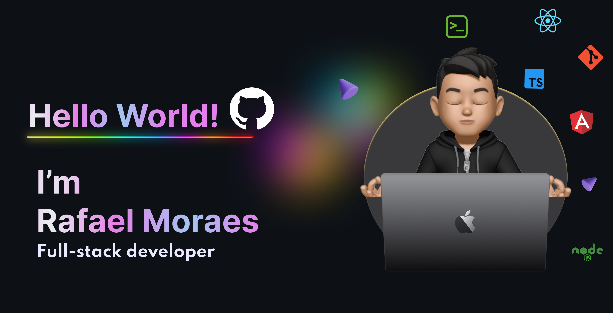
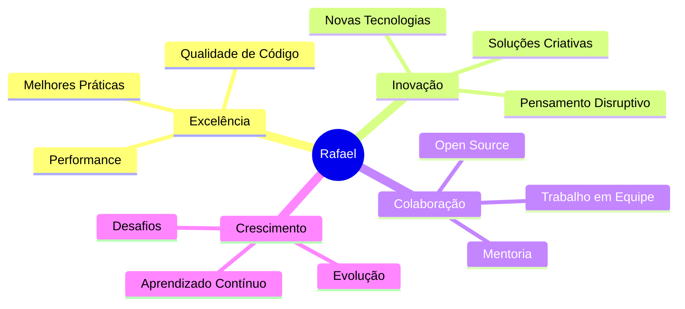

<div align="center">

<br>
</div>
<div align="center">

  <a href="https://github.com/Rafael01Gx">
    
  </a>
  


</div>

---

<div align="center">
  <a href="https://github.com/Rafael01Gx" target="_blank"></a>
  <a href="https://www.linkedin.com/in/rafael-moraes-8aa185276/" target="_blank"></a>
  <a href="https://instagram.com/xrafaelgx" target="_blank"></a>
  <a href="https://steamcommunity.com/id/rafael01gx" target="_blank"></a>
</div>

---

## 🎭 Quem Sou Eu?

> *"Sou mais do que apenas um desenvolvedor - sou um contador de histórias digitais, um arquiteto de experiências e um eterno aprendiz no universo da tecnologia."*

**🚀 Desenvolvedor Full-Stack** nascido em **Minas Gerais**, com o coração cheio de café e a mente repleta de códigos! Transformo ideias complexas em soluções elegantes e funcionais, sempre com um toque mineiro de hospitalidade no meu código.

Minha jornada começou com a curiosidade de entender como as coisas funcionam "por debaixo dos panos" e evoluiu para a paixão de criar experiências digitais que fazem a diferença na vida das pessoas. Cada linha de código que escrevo carrega a intenção de tornar o mundo um pouco mais conectado e eficiente.

### 🎯 Minha Missão
Criar soluções tecnológicas que não apenas funcionem, mas que encantem, surpreendam e facilitem a vida das pessoas. Acredito que a tecnologia deve ser uma ponte, não uma barreira.

<div align="center">
  
[](https://linkedin.com/in/rafael-moraes-8aa185276)
[](https://rafaelmoraesdev.com.br)
[](mailto:rafael_junio_moraes@hotmail.com)

</div>

---
<div align="center"> 
## 🛠️ Arsenal Tecnológico

### 🎨 Frontend - *Onde a Magia Visual Acontece*
<div align="center">
  
</div>

 *"Transformo wireframes em experiências interativas que os usuários adoram usar"*

### ⚙️ Backend - *A Força Por Trás da Aplicação*
<div align="center">
  
</div>

 *"Construo APIs robustas e escaláveis que aguentam qualquer tempestade de requisições"*

### 🗄️ Banco de Dados - *Onde os Dados Ganham Vida*
<div align="center">
  
</div>

 *"Organizo dados como um bibliotecário organiza livros - tudo no lugar certo, na hora certa"*

### 🔧 DevOps & Ferramentas - *O Ecossistema Perfeito*
<div align="center">
  
</div>
</div>

---

## 📊 Minha Jornada em Números

<div align="center">
  
  
</div>

<div align="center">
  
</div>

---

## 🏆 Conquistas & Reconhecimentos

<div align="center">
  
</div>

---

## 🚀 Projetos Que Mudaram o Jogo

<div align="center">
  
### 🌟 Destaques da Minha Criatividade

<a href="[https://github.com/Rafael01Gx/projeto-inovador](https://github.com/Rafael01Gx/gsap_Awwwards)">
  
</a>
<a href="https://github.com/Rafael01Gx/nest-lab-api">
  
</a>

</div>

---

## 📈 Minha Evolução Contínua

<div align="center">
  
</div>

---

## 💡 Minha Filosofia de Código

```typescript
class RafaelMoraes implements Developer {
  readonly name = 'Rafael Moraes';
  readonly location = 'Minas Gerais, Brasil 🇧🇷';
  readonly passion = 'Transformar café em código extraordinário ☕';
  
  private skills = {
    frontend: ['Angular', 'TypeScript', 'Ionic', 'HTML5', 'CSS3'],
    backend: ['NestJS', 'Node.js', 'Express.js', 'TypeScript'],
    database: ['MongoDB', 'MySQL', 'PostgreSQL', 'Prisma ORM'],
    architecture: ['Clean Architecture', 'SOLID', 'DDD', 'TDD'],
    mindset: ['Curiosidade', 'Inovação', 'Colaboração', 'Excelência']
  };
  
  getCurrentFocus(): string {
    return 'Construindo o futuro, uma linha de código por vez';
  }
  
  getMotivation(): string {
    return 'Cada problema é uma oportunidade de crescimento disfarçada';
  }
  
  getDreamProject(): string {
    return 'Criar tecnologia que democratize o acesso à educação';
  }
}

const developer = new RafaelMoraes();
console.log(developer.getCurrentFocus()); // 🚀
```

---

## 🌟 O Que Me Move

<div align="center">
  
| 🎯 **Objetivo** | 🚀 **Ação** | 💡 **Resultado** |
|:---:|:---:|:---:|
| **Inovar** | Pesquisar novas tecnologias | Soluções cutting-edge |
| **Colaborar** | Contribuir com a comunidade | Conhecimento compartilhado |
| **Crescer** | Aprender continuamente | Expertise em evolução |
| **Impactar** | Resolver problemas reais | Mundo mais conectado |

</div>

---

## 🎨 Meus Valores

<div align="center">
  


</div>

---

## 📚 Atualmente Explorando

<div align="center">
  
| 🔥 **Tecnologia** | 📊 **Progresso** | 🎯 **Objetivo** |
|:---:|:---:|:---:|
| **IA & Machine Learning** |  | Integrar IA nas aplicações |
| **Microserviços** |  | Arquiteturas escaláveis |
| **Cloud Native** |  | Deploy na nuvem |
| **GraphQL** |  | APIs mais eficientes |

</div>

---

## 🎪 Curiosidades Sobre Mim

<div align="center">
  
🎵 **Playlist de Código**: Rock ou Clássica + Café = Produtividade Máxima  
🌄 **Inspiração**: As montanhas de Minas me ensinam que todo grande projeto começa com uma base sólida  
🍕 **Fuel**: Pizza + Código = Combinação perfeita para madrugadas produtivas  
🎮 **Break Time**: Gamer nas horas vagas - estratégia também é código!  
📚 **Sempre Lendo**: Livros de tecnologia, filosofia e ficção científica  

</div>

---

## 🤝 Vamos Construir Algo Incrível Juntos?

<div align="center">
  
### 💬 *"As melhores ideias nascem da colaboração!"*

Sou aquele tipo de pessoa que acredita que **duas mentes pensam melhor que uma**. Se você tem uma ideia maluca, um projeto desafiador ou simplesmente quer trocar uma ideia sobre tecnologia, eu estou aqui!

**🚀 Seja para:**
- Desenvolver uma aplicação revolucionária
- Resolver um problema técnico complexo  
- Fazer uma mentoria ou ser mentorado
- Contribuir para projetos open source
- Ou simplesmente tomar um café virtual e falar sobre o futuro da tech

### 📬 **Canais de Comunicação**

[](https://linkedin.com/in/rafael-moraes-8aa185276)
[](mailto:rafael_junio_moraes@hotmail.com)
[](https://wa.me/5531992482029)


</div>

---

## 💎 Citações Que Me Inspiram

<div align="center">
  
> *"O código é como poesia - deve ser elegante, expressivo e memorável"*  
> **- Rafael Moraes**

> *"A tecnologia avança quando servimos aos outros, não a nós mesmos"*  
> **- Tim Cook**

> *"Todo mundo deveria aprender a programar um computador, porque isso ensina você a pensar"*  
> **- Steve Jobs**

</div>

---

<div align="center">
  


</div>

---

<div align="center">
  
## 🌟 Obrigado por Visitar Meu Universo Digital!

**Se chegou até aqui, você é realmente especial! 🎉**

*Não esqueça de deixar uma* ⭐ *nos repositórios que curtir e vamos juntos transformar o mundo através da tecnologia!*

### 💝 *"Até a próxima commit!"*

---


**🚀 Keep coding, keep growing, keep dreaming! 🚀**

</div>
