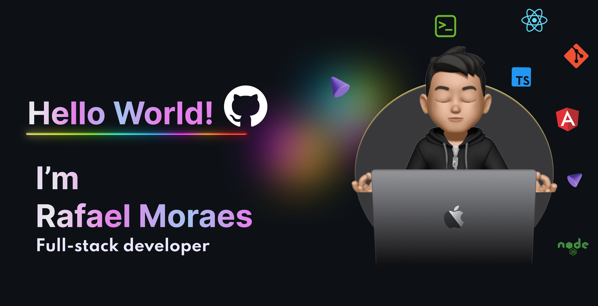
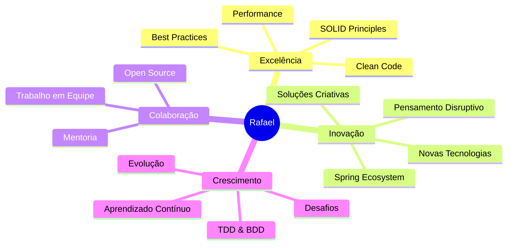

<div align="center">

<br>
</div>
<div align="center">

  <a href="https://github.com/Rafael01Gx">
    
  </a>
  


</div>

---

<div align="center">
  <a href="https://github.com/Rafael01Gx" target="_blank"></a>
  <a href="https://www.linkedin.com/in/rafael-moraes-dev/" target="_blank"></a>
  <a href="https://instagram.com/xrafaelgx" target="_blank"></a>
  <a href="https://steamcommunity.com/id/rafael01gx" target="_blank"></a>
</div>

---

## 🎭 Quem Sou Eu?

> *"Sou mais do que apenas um desenvolvedor - sou um contador de histórias digitais, um arquiteto de experiências e um eterno aprendiz no universo da tecnologia."*

**🚀 Desenvolvedor Full-Stack** nascido em **Minas Gerais**, com o coração cheio de café e a mente repleta de códigos! Transformo ideias complexas em soluções elegantes e funcionais, sempre com um toque mineiro de hospitalidade no meu código.

Minha jornada começou com a curiosidade de entender como as coisas funcionam "por debaixo dos panos" e evoluiu para a paixão de criar experiências digitais que fazem a diferença na vida das pessoas. Cada linha de código que escrevo carrega a intenção de tornar o mundo um pouco mais conectado e eficiente.

### 🎯 Minha Missão
Criar soluções tecnológicas que não apenas funcionem, mas que encantem, surpreendam e facilitem a vida das pessoas. Acredito que a tecnologia deve ser uma ponte, não uma barreira.

<div align="center">
  
[](https://linkedin.com/in/rafael-moraes-dev)
[](https://rafaelmoraesdev.com.br)
[](mailto:rafael_junio_moraes@hotmail.com)

</div>

---
<div align="center"> 
## 🛠️ Arsenal Tecnológico

### 🎨 Frontend - *Onde a Magia Visual Acontece*
<div align="center">
  
</div>

 *"Transformo wireframes em experiências interativas que os usuários adoram usar"*

### ⚙️ Backend - *A Força Por Trás da Aplicação*
<div align="center">
  
</div>

 *"Construo APIs robustas e escaláveis que aguentam qualquer tempestade de requisições"*

#### ☕ **Java Ecosystem - O Poder Corporativo**
<div align="center">
  


</div>

 *"Desenhando arquiteturas que encontram caminhos que nem eu sabia que existiam"

### 🗄️ Banco de Dados - *Onde os Dados Ganham Vida*
<div align="center">
  
</div>

 *"Organizo dados como um bibliotecário organiza livros - tudo no lugar certo, na hora certa"*

### 🔧 DevOps & Ferramentas - *O Ecossistema Perfeito*
<div align="center">
  
</div>
</div>

---

## 📊 Minha Jornada em Números

<div align="center">
  
  
</div>

<div align="center">
  
</div>

---

## 🏆 Conquistas & Reconhecimentos

<div align="center">
  
</div>

---

## 🚀 Projetos Que Mudaram o Jogo

<div align="center">
  
### 🌟 Destaques da Minha Criatividade

<a href="https://github.com/Rafael01Gx/gsap_Awwwards">
  
</a>
<a href="https://github.com/Rafael01Gx/nest-lab-api">
  
</a>

</div>

---

## 📈 Minha Evolução Contínua

<div align="center">
  
</div>

---

## 💡 Minha Filosofia de Código

```java
@Service
@RequiredArgsConstructor
public class RafaelMoraesService implements Developer {
    
    private final String name = "Rafael Moraes";
    private final String location = "Minas Gerais, Brasil 🇧🇷";
    private final String passion = "Transformar café em código extraordinário ☕";
    
    @Data
    @Builder
    private static class Skills {
        private List<String> frontend = List.of("Angular", "React", "TypeScript", "Ionic", "HTML5", "CSS3");
        private List<String> backend = List.of("Java", "Spring Boot", "NestJS", "Node.js", "Express.js");
        private List<String> database = List.of("MongoDB", "MySQL", "PostgreSQL", "Prisma ORM");
        private List<String> testing = List.of("JUnit 5", "Mockito", "Spring Test", "TDD");
        private List<String> architecture = List.of("Clean Architecture", "SOLID", "DDD", "Design Patterns");
        private List<String> security = List.of("Spring Security", "JWT", "OAuth2", "SSL/TLS");
        private List<String> mindset = List.of("Curiosidade", "Inovação", "Colaboração", "Excelência");
    }
    
    public String getCurrentFocus() {
        return "Construindo sistemas enterprise escaláveis com Spring Boot e arquitetura limpa";
    }
    
    public String getMotivation() {
        return "Cada problema é uma oportunidade de crescimento disfarçada";
    }
    
    @Transactional
    public String getDreamProject() {
        return "Criar tecnologia que democratize o acesso à educação";
    }
    
    // Clean Code + SOLID em ação! 🚀
}
```

---

## 🌟 O Que Me Move

<div align="center">
  
| 🎯 **Objetivo** | 🚀 **Ação** | 💡 **Resultado** |
|:---:|:---:|:---:|
| **Inovar** | Pesquisar novas tecnologias | Soluções cutting-edge |
| **Colaborar** | Contribuir com a comunidade | Conhecimento compartilhado |
| **Crescer** | Aprender continuamente | Expertise em evolução |
| **Impactar** | Resolver problemas reais | Mundo mais conectado |

</div>

---

## 🎨 Meus Valores

<div align="center">
  

```mermaid
mindmap
  root((Rafael))
    Excelência
      Clean Code
      SOLID Principles
      Best Practices
      Performance
    Inovação
      Spring Ecosystem
      Novas Tecnologias
      Soluções Criativas
      Pensamento Disruptivo
    Colaboração
      Trabalho em Equipe
      Mentoria
      Open Source
    Crescimento
      TDD & BDD
      Aprendizado Contínuo
      Desafios
      Evolução
```

</div>

---

## 📚 Atualmente Explorando

<div align="center">
  
| 🔥 **Tecnologia** | 📊 **Progresso** | 🎯 **Objetivo** |
|:---:|:---:|:---:|
| **Spring Boot 3.x** |  | APIs RESTful robustas |
| **Microserviços** |  | Arquiteturas escaláveis |
| **Spring Security** |  | Segurança enterprise |
| **TDD com JUnit & Mockito** |  | Código testável e confiável |
| **Cloud Native (AWS/GCP)** |  | Deploy na nuvem |
| **GraphQL** |  | APIs mais eficientes |

</div>

---

## 🎪 Curiosidades Sobre Mim

<div align="center">
  
☕ **Café & Código**: Java (linguagem) + Java (café) = Produtividade infinita!  
🎵 **Playlist de Código**: Rock ou Clássica para debugar, Lo-fi para criar  
🌄 **Inspiração**: As montanhas de Minas me ensinam que todo grande projeto começa com uma base sólida  
🍕 **Fuel**: Pizza + Código = Combinação perfeita para madrugadas produtivas  
🎮 **Break Time**: Gamer nas horas vagas - estratégia também é código!  
📚 **Sempre Lendo**: Clean Code, Domain-Driven Design e ficção científica  
🧪 **TDD Lover**: Red, Green, Refactor - o mantra perfeito!  

</div>

---

## 🏗️ Princípios que Guiam Meu Código

<div align="center">

### ⚡ SOLID em Ação

```
🔹 S - Single Responsibility: Uma classe, uma responsabilidade
🔹 O - Open/Closed: Aberto para extensão, fechado para modificação  
🔹 L - Liskov Substitution: Subtipos devem ser substituíveis
🔹 I - Interface Segregation: Interfaces específicas e enxutas
🔹 D - Dependency Inversion: Dependa de abstrações, não de implementações
```

### 🧹 Clean Code Mindset


</div>

---

## 🤝 Vamos Construir Algo Incrível Juntos?

<div align="center">
  
### 💬 *"As melhores ideias nascem da colaboração!"*

Sou aquele tipo de pessoa que acredita que **duas mentes pensam melhor que uma**. Se você tem uma ideia maluca, um projeto desafiador ou simplesmente quer trocar uma ideia sobre tecnologia, eu estou aqui!

**🚀 Seja para:**
- Desenvolver uma aplicação revolucionária com Spring Boot
- Resolver um problema técnico complexo  
- Fazer uma mentoria ou ser mentorado
- Contribuir para projetos open source
- Debater sobre Clean Architecture e Design Patterns
- Ou simplesmente tomar um café virtual e falar sobre o futuro da tech

### 📬 **Canais de Comunicação**

[](https://linkedin.com/in/rafael-moraes-dev)
[](mailto:rafael_junio_moraes@hotmail.com)
[](https://wa.me/5531992482029)

</div>

---

## 💎 Citações Que Me Inspiram

<div align="center">
  
> *"O código é como poesia - deve ser elegante, expressivo e memorável"*  
> **- Rafael Moraes**

> *"Qualquer tolo consegue escrever código que um computador entenda. Bons programadores escrevem código que humanos entendam"*  
> **- Martin Fowler**

> *"A tecnologia avança quando servimos aos outros, não a nós mesmos"*  
> **- Tim Cook**

> *"Clean code always looks like it was written by someone who cares"*  
> **- Robert C. Martin**

</div>

---

<div align="center">
  


</div>

---

<div align="center">
  
## 🌟 Obrigado por Visitar Meu Universo Digital!

**Se chegou até aqui, você é realmente especial! 🎉**

*Não esqueça de deixar uma* ⭐ *nos repositórios que curtir e vamos juntos transformar o mundo através da tecnologia!*

### 💝 *"Até o próximo commit!"*

---


**🚀 Keep coding, keep testing, keep learning! ☕**

</div>
